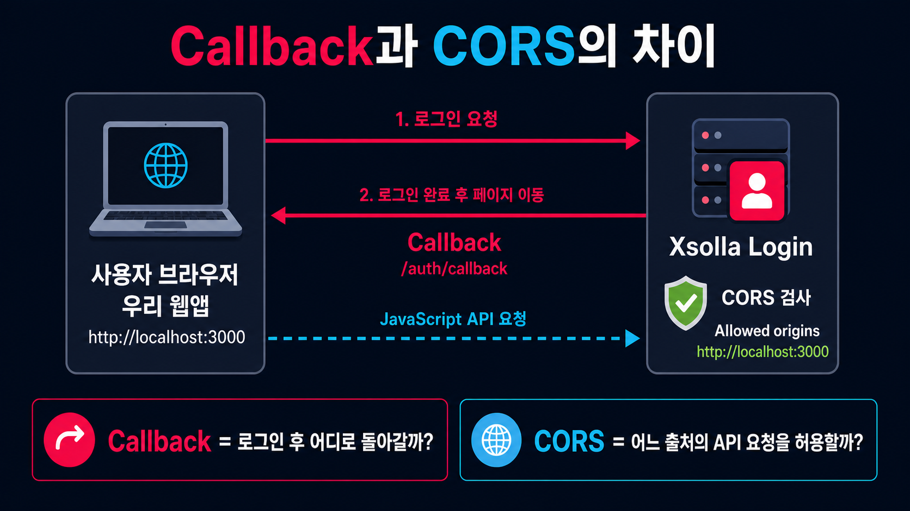

# 로그인 방법

## 무엇을 설정했는가

- **Social login 선택**: 이메일·비밀번호를 직접 관리하는 대신 소셜 계정을 사용하도록 Login 프로젝트의 기본 흐름을 정했다.
- **Google 연결**: Google Cloud에서 웹 애플리케이션용 OAuth Client를 만들고 Xsolla에 Client ID와 Client Secret을 등록했다.
- **Google 사용자 데이터 범위**: `openid`, `profile`, `email`만 사용했다. 로그인에 필요하지 않은 Google API 권한은 추가하지 않았다.
- **Apple 연결 보류**: 자체 Apple 애플리케이션 연결에는 Apple Developer Program 가입이 필요하므로 학습 범위에서 제외했다.

## Google에 등록한 Redirect URI

```text
https://login.xsolla.com/api/social/oauth2/callback
```

이 주소는 우리 웹숍의 Callback이 아니다. Google이 인증 결과를 먼저 Xsolla에 전달하는 Xsolla 소셜 로그인 전용 주소다.

## 웹숍 Callback

```text
성공: http://localhost:3000/auth/callback
실패: http://localhost:3000/auth/error
출처: http://localhost:3000
```

- **성공 Callback**: 로그인, 이메일 확인 또는 비밀번호 재설정 성공 후 사용자가 돌아오는 웹숍 주소
- **Error Callback**: 인증 오류가 발생했을 때 사용자가 돌아오는 웹숍 주소
- **Allowed Origin**: 경로가 아닌 `scheme + host + port`로만 구성된 브라우저 출처

## Callback과 CORS의 차이



| 구분 | Callback | CORS |
|---|---|---|
| 핵심 질문 | 로그인 후 사용자를 어디로 보낼까? | 어떤 웹 출처가 API 응답을 읽어도 될까? |
| 동작 | 브라우저 페이지 이동 | 브라우저의 교차 출처 요청 허용 여부 판단 |
| 값의 형태 | 전체 경로 포함 가능 | 일반적으로 `scheme + host + port`만 사용 |
| 현재 예시 | `http://localhost:3000/auth/callback` | `http://localhost:3000` |

두 설정은 서로 대체하지 않는다. Callback이 올바르더라도 CORS가 허용되지 않으면 브라우저의 API 호출이 차단될 수 있고, CORS가 허용돼도 Callback이 없으면 로그인 완료 후 돌아올 페이지가 정해지지 않는다.

## Xsolla 내부 URL을 유지한 이유

소셜 제공자가 인증 결과를 Xsolla로 돌려보내는 내부 Callback과 Xsolla 위젯 동작에 필요한 주소가 이미 등록돼 있었다. 이 주소들은 우리 웹숍 Callback과 역할이 다르므로 삭제하지 않았다.

## 로그인 API 통합

- 화면에 있던 **장치 ID 로그인**은 웹숍 Google 로그인과 무관하다.
- 장치 ID 로그인은 모바일 기기에서 입력 없이 임시 계정을 자동 생성할 때 사용하는 기능이다.
- 현재 웹숍은 Google 계정을 식별자로 사용하므로 장치 ID 로그인은 사용하지 않는다.
- 실제 API 통합은 이후 프런트엔드에서 Xsolla Login Widget SDK를 연결하면서 진행한다.

## 정상 동작 확인

- Xsolla의 테스트 위젯이 열렸다.
- 위젯에 Google 로그인 버튼이 표시됐다.
- Google 계정 인증이 성공했다.
- Xsolla 사용자 저장소에서 테스트 사용자를 확인할 수 있는 상태가 됐다.
